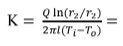

## INTRODUCTION

Materials that offer high resistance to the flow of heat are called as heat insulators. Heat insulators find extensive application in the systems where heat losses are to be minimized such as heat transmission lines in power plants, furnaces etc.

In many heat transfer equipment, heat loss to the surroundings is to be minimized to maximize the economy. In such cases, they are lagged by materials of lower thermal conductivity, which are referred to as insulators. Powders have the advantage of taking any shape between any two conforming surfaces. In addition, it's thermal conductivity will be much lower than that of the solid from which it was made. This is because of the large air space between the particles, which have very low values of thermal conductivity. Thermal conductivity of such material is a complicated function of geometry of the particles, thermal conductivity of the particles, the nature of heat transfer between the air particles which depends of the magnitude of the air space and temperature etc. Thus, it is very difficult to estimate the thermal conductivity in most practical cases. The set up provided is one such apparatus to find thermal conductivity.

Rate of heat transfer through a material is given by,

<!--  -->

$Q = -kA\frac{dT}{dx}$

Where,  
$Q$ = Rate of heat transfer in $Watt$  
$K$ = Co-efficient of thermal conductivity in $W/m°C $   
$A$ = Area of heat transfer in $m^2$  
$ΔT$ = Temperature between the walls in $°C$  
$ΔX$ = Thickness of the material in $m$

Insulators have low thermal conductivities say, about 0.1 $W/m°C$ to 1 $W/m°C$ whereas metals
which are good thermal conductors have co-efficient of thermal conductivity as high as
200 $W/m°C$

The setup as shown in Fig. 1 has been designed to study conduction heat transfer through insulating powder and
to determine its co-efficient of thermal conductivity.
The setup consists of two pipes placed concentrically i.e one inside the other. The gap between the pipes is filled with insulating material (powder) and a heater is placed in the middle of the smaller pipe. Five thermocouples are placed to measure the temperatures in the locations as shown in the figure and the heat input can be varied accordingly to obtain the radial temperature distribution.

Fig 1. Heat flow through lagged pipe

#### Equations/formulas:

Mean temperature $(˚C)$

<!--  -->

<!--  -->

$T_i = \frac{T_1 + T_2 + T_3}{3}$

$T_o = \frac{ T_4 + T_5}{2}$

Heat conducted through composite cylinder, $Q = VI$

Thermal conductivity of insulating material (saw dust) in $W/mK$

<!--  -->

$K = \frac{Qln(r_2/r_1)}{2πl(T_i - T_o)}$

Temperature profile in radial direction in the cylinder

<!--  -->

$\frac{T - T1}{T2 - T1} = \frac{ln(r/r_1)}{ln(r_2/r_1)}$

Inner pipe diameter $d_1$ = 45 $mm$  
Outer pipe diameter $d_2$ = 75 $mm$  
Length of the pipe $(l)$ = 500 $mm$  
Outer surface inner pipe temperature: $T_1$, $T_2$ and $T_3$  
Inner surface temperature: $T_4$ and $T_5$
